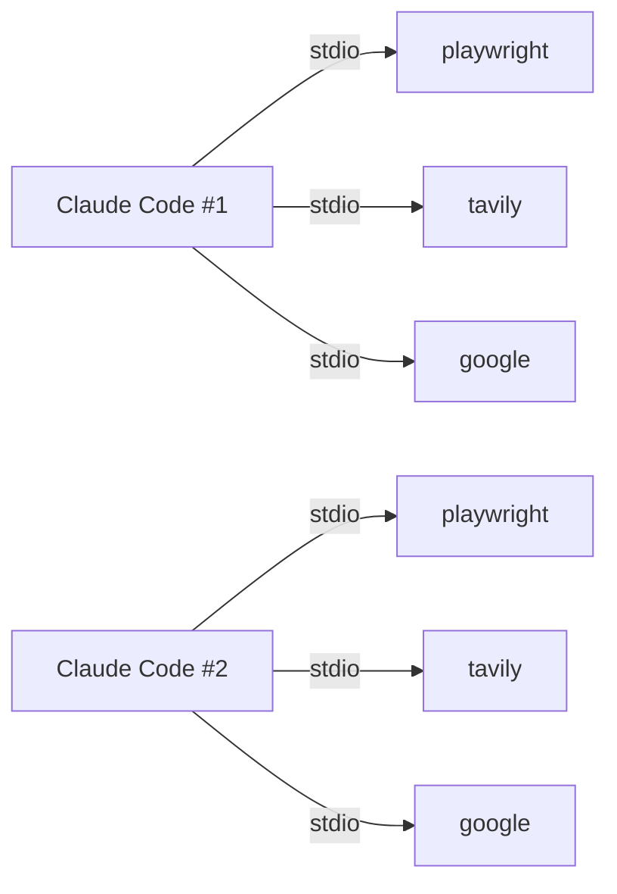
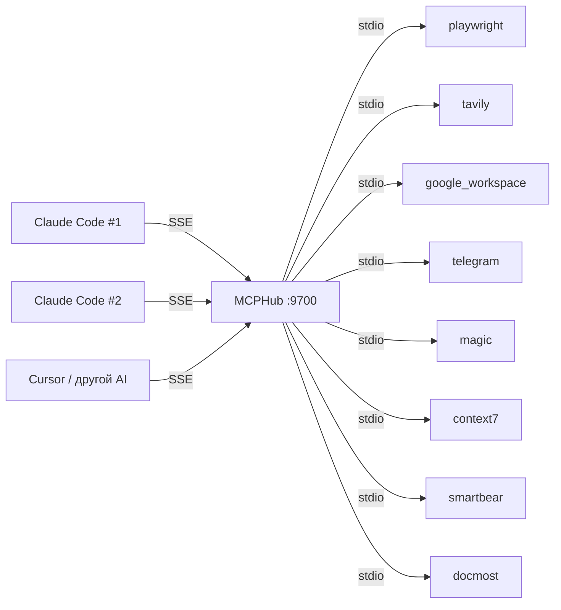

# MCP-Hub

Централизованный хаб MCP серверов для [Claude Code](https://docs.anthropic.com/en/docs/claude-code) и других AI-клиентов.
Один процесс вместо десятка. Все настройки в git. Построен на [MCPHub](https://github.com/samanhappy/mcphub).

## Проблема

Стандартный подход — каждая сессия Claude Code запускает MCP серверы как stdio-процессы:



- **Дублирование процессов.** 5 сессий × 7 серверов = 35 процессов
- **Медленный старт.** Каждый запуск сессии — 5-15 сек ожидания
- **Настройки разбросаны.** `~/.claude.json`, systemd-юниты, разные конфиги
- **Нет версионирования.** Изменил конфиг — перезапусти все сессии

## Решение

Один MCPHub-процесс держит все серверы. Сессии подключаются через SSE — мгновенно:



- **Один набор процессов** на все сессии и всех AI-клиентов
- **Мгновенное подключение** — серверы уже запущены
- **Всё в git** — конфигурация версионируется, шарится с командой
- **Один `make restart`** — и все сессии подхватили изменения

## Quick Start

1. Склонировать и установить:
   ```bash
   git clone git@github.com:dapi/mcp-hub.git
   cd mcp-hub
   make install    # проверит Node.js, создаст .env
   ```

2. Заполнить API-ключи в `.env`

3. Запустить:
   ```bash
   make setup      # настроит автозапуск (systemd/launchd)
   make start
   make open       # откроет dashboard
   ```

4. Подключить серверы к клиенту:
   ```bash
   make claude-install    # установит все серверы в Claude Code
   make codex-install     # установит все серверы в Codex CLI
   make cursor-install    # установит все серверы в Cursor
   ```

5. Перезапустить сессию клиента (Claude/Codex)

## Миграция с отдельных MCP серверов

Если MCP серверы запускаются через stdio или как отдельные systemd-сервисы:

### 1. Перенести конфиг сервера в mcp_settings.json

Добавить сервер в `mcp_settings.json` (формат тот же что в stdio).

### 2. Удалить старый stdio-сервер из Claude Code

```bash
claude mcp remove playwright
```

### 3. Остановить systemd-сервис (если был)

```bash
systemctl --user disable --now playwright-mcp
rm ~/.config/systemd/user/playwright-mcp.service
systemctl --user daemon-reload
```

### 4. Подключить все серверы через хаб

```bash
make claude-install
make codex-install
make cursor-install
```

### 5. Перезапустить хаб

```bash
make restart
```

## Команды

| Команда | Описание |
|---------|----------|
| `make install` | Проверить зависимости, создать .env |
| `make install-deps` | Установить CLI-инструменты (himalaya, tgcli, gh) |
| `make start` | Запустить MCPHub |
| `make stop` | Остановить MCPHub |
| `make restart` | Перезапустить MCPHub |
| `make status` | Показать статус |
| `make logs` | Показать логи |
| `make setup` | Настроить автозапуск (systemd/launchd) |
| `make unsetup` | Удалить автозапуск |
| `make open` | Открыть dashboard |
| `make claude-install` | Установить все MCP серверы в Claude Code |
| `make claude-uninstall` | Удалить все MCP серверы из Claude Code |
| `make codex-install` | Установить все MCP серверы в Codex CLI |
| `make codex-uninstall` | Удалить все MCP серверы из Codex CLI |
| `make codex-update` | Переустановить все MCP серверы в Codex CLI |
| `make cursor-install` | Установить все MCP серверы в Cursor (`~/.cursor/mcp.json`) |
| `make cursor-uninstall` | Удалить все MCP серверы из Cursor |
| `make cursor-update` | Переустановить все MCP серверы в Cursor |
| `make mcp-install` | Установить MCP серверы во все AI-клиенты |
| `make mcp-reinstall` | Переустановить MCP серверы во все AI-клиенты |
| `make install-telegram` | Установить mcp-telegram |
| `make telegram-sign-in` | Авторизоваться в Telegram |

## Добавление нового сервера

1. Добавить в `mcp_settings.json`:
   ```json
   "my_server": {
     "command": "npx",
     "args": ["-y", "my-mcp-server"],
     "env": { "API_KEY": "${MY_API_KEY}" }
   }
   ```
   > **Важно:** поле `"args"` обязательно, даже если пустое (`[]`)

2. Добавить переменные в `.env`

3. Перезапустить хаб и обновить Claude Code:
   ```bash
   make restart
   make claude-install
   make codex-install
   make cursor-install
   ```

## CLI-инструменты

Некоторые инструменты лучше использовать напрямую через CLI, а не через MCP-сервер. Причины:

- **Скорость** — прямой вызов CLI быстрее, чем маршрутизация через MCP
- **Надёжность** — меньше промежуточных слоёв, меньше точек отказа
- **Простота** — Claude Code вызывает их через Bash без дополнительной настройки

| Инструмент | Назначение | Установка |
|-----------|-----------|-----------|
| [himalaya](https://github.com/pimalaya/himalaya) | Email — чтение, отправка, управление | `cargo install himalaya` / `brew install himalaya` |
| [tgcli](https://github.com/erayerdin/tgcli) | Telegram — отправка сообщений из CLI | `pip3 install tgcli` |
| [gh](https://cli.github.com/) | GitHub — PR, issues, reviews, API | `apt install gh` / `brew install gh` |

Установить все сразу:

```bash
make install-deps
```

## Текущие серверы

| Сервер | Назначение | Требует ключ |
|--------|-----------|-------------|
| playwright | Браузер, скриншоты | — |
| tavily | Веб-поиск | TAVILY_API_KEY |
| google_workspace | Drive, Docs, Sheets | OAuth credentials |
| telegram | Чтение сообщений | API_ID + API_HASH |
| magic | UI-компоненты | MAGIC_API_KEY |
| context7 | Документация библиотек | CONTEXT7_API_KEY |
| smartbear | Bugsnag мониторинг | BUGSNAG_API_KEY |
| docmost | Wiki/документация | DOCMOST_API_URL + credentials |

## Платформы

- **Linux**: systemd --user
- **macOS**: launchd

## Лицензия

MIT
